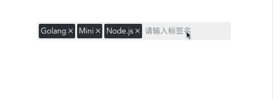

# Vue-Tags

## 使用

```bash
npm install --save vue-tags-simple

# 或者

yarn add vue-tags-simple
```



## 食用指导

通过一个简单的 **5** 步教学，让你了解本控件所有功能！

### 1. 添加

尝试着在输入框中输入 `Google`，然后按 **Enter** 键，即可添加该标签！

### 2. 删除标签

那个名为 `Mini` 的标签我也不知道是干嘛的，通过点击该标签右侧的 **✕** 来将其移除。

当前我们的输入框什么都没有，请在输入框中点击一下，让它获得焦点。然后我觉得这个 `Google` 也没什么用，按下 **Backspace** 来删除最后一个元素。

### 3. 自动补全

嗯，我觉得应该加上 `Kubernetes` 这个标签，让我们先输入 `Ku` 这两个字符，这个单词太长了，我不想挨个儿输完 (其实是忘了怎么拼写😂 )。

那可以偷个懒，看到了输入框中那个**浅蓝色的文字**吗？插件已经知道我们要输入什么了，你只需要按下 **Tab** 键即可瞬间自动补全（也可以鼠标双击输入框），补全后再按 **Enter** 将其添加进去！

### 4. 重复提示

好像不对，刚才添加进去的 `kubernetes` 怎么是小写的！我想要这种效果的：`Kubernetes`，那试着再在输入框中输入 `Ku` 然后自动补全。

完了，怎么自动补全直接就把我刚才的大写 `K` 换成小写了。。。好吧，手动修改第一个字母为大写！完美！然后按 **Enter**。

Naive！控件检测到这两个标签除了大小写不同其他都一样，所以拒绝了添加这个控件，并且通过闪动已有标签的方式提醒你：这个标签加过啦！

### 5. 修改大小写

如果只是大小写不同，控件是会拒绝添加的（因为本来就是一个东西），如果想要修改已有标签的大小写，有一个非常简单的办法：同时按下 **Shift** 和 **Enter**，完事儿！

这些便是基础用法，更多功能只有你自己去发现了😼

## 本地运行 Demo

```bash
git clone https://github.com/AielloChan/vue-tags.git
cd vue-tags
npm install
npm run dev

# Then have fun !!
```